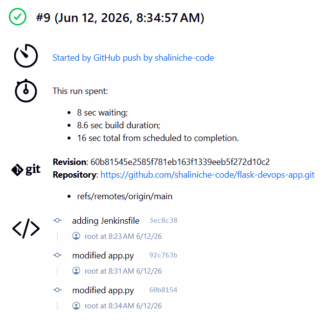
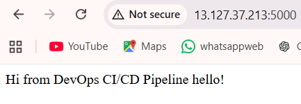
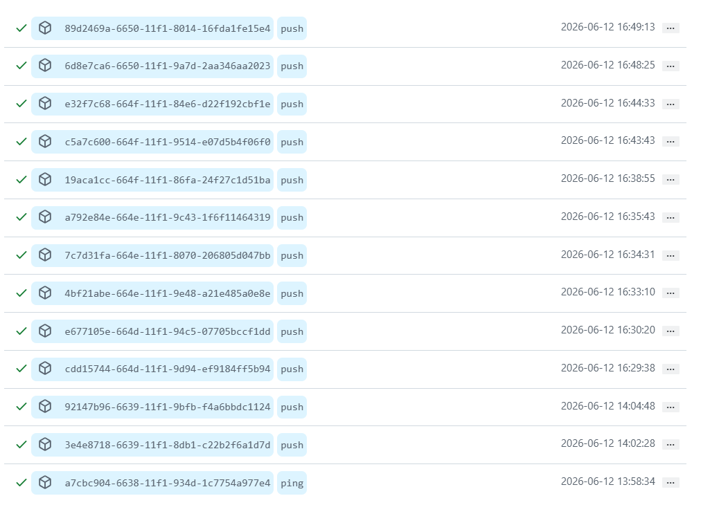
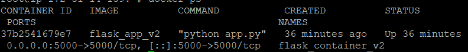

# CI/CD Pipeline for Flask Application Deployment

## Project Overview

Built an end-to-end CI/CD pipeline using GitHub, Jenkins, Docker, and AWS EC2.

## Architecture

```text
Developer
    ↓
GitHub
    ↓
GitHub Webhook
    ↓
Jenkins Pipeline
    ↓
Docker Build
    ↓
Docker Deploy
    ↓
Flask Application on AWS EC2
```


## Skills Demonstrated

- Git
- GitHub
- Jenkins
- Docker
- AWS EC2
- Linux
- CI/CD

## Jenkins Build Success



## Containerized Application



## GitHub Webhook Trigger



## Docker Running Container


